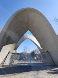

## Iran University of Science and Technology (IUST)
امکانات:
- سرسبزی
- فضای بزرگ
- دانشکده های متعدد

[سایت دانشگاه](http://www.iust.ac.ir/)

Iran University of Science and Technology is a research institution and university of engineering and science in Iran. The university is home to 15 faculties offering undergraduate and postgraduate degrees in a wide range of engineering-based subjects as well as maths, physics, and department of foreign languages.

---
**Test**: This is atest
