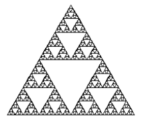

## ترم 1
کار های گرافیکی:
- درخت
- مثلث
- جنگل
- ستاره

[پروژه درخت](file:///C:/git/FC02031.copy/S9/tree.html)
[پروژه مثلث](file:///C:/git/FC02031.copy/S9/triangle.html)
این پروژه ها با کتاب خانه لاکپشت و به وسیله تابع بازگشتی ساخته شده اند

# کد های پروژه درخت:
    import turtle
    turtle.speed(0)
    
    def barg1(n,s):
        turtle.fillcolor("darkgreen")
        turtle.begin_fill()
        for _ in range(n):
            turtle.forward(s)
            turtle.left(360/n)
        turtle.end_fill()    
        turtle.fillcolor("lightgreen")
        turtle.begin_fill()    
        for _ in range(n):
            turtle.forward(s)
            turtle.right(360/n)
    
    
        turtle.end_fill()
    def dayere(n,s):
        turtle.fillcolor("green")
        turtle.begin_fill()
        for _ in range(n+1):
            turtle.forward(s)
            turtle.left(360/n)
        turtle.end_fill()
    
    def barg(n,s):
        turtle.fillcolor("orange")
        turtle.begin_fill()
        for _ in range(n+1):
            turtle.forward(s)
            turtle.left(360/n)
        for _ in range(n+1):
            turtle.forward(s)
            turtle.right(360/n)
        turtle.left(90)
        for _ in range(n+1):
            turtle.forward(s)
            turtle.right(360/n)
        turtle.right(180)
        for _ in range(n+1):
            turtle.forward(s)
            turtle.right(360/n)
    
    
        turtle.end_fill()
    
    
    def rishe(d, r):
    
        if d < 15 or r < 10:
            return
        turtle.pensize(1)
        turtle.forward(d)
        turtle.left(r)
        rishe(d * 0.755, r)
        turtle.right(2 * r)
        rishe(d * 0.755, r)
        turtle.left(r)
        turtle.backward(d)
    
    
    turtle.left(90)
    turtle.speed(0)
    turtle.pensize(2)
    turtle.pencolor("black")
    turtle.right(180)
    rishe(50, 80)
    turtle.left(35)
    rishe(50, 80)
    turtle.right(70)
    rishe(50, 80)
    turtle.left(35)
    turtle.left(180)
    turtle.pencolor("brown")
    turtle.right(90)
    
    
    def tree(d, r):
        
        if d < 13 or r < 10:
            return
        if d==100:
            turtle.pensize(15)
        elif d==(100*0.755):
            turtle.pensize(8)
        elif d==(100*0.755*0.755):
            turtle.pensize(4)
        elif d==(100*0.755*0.755*0.755):    
            turtle.pensize(2)
        elif d==(100*0.755*0.755*0.755*0.755):
             turtle.pensize(0.8)
        elif d==(100*0.755*0.755*0.755*0.755):
            turtle.pensize(0.6)
    
             
    
        turtle.forward(d)
        if d<15:
            
            barg1(6,5)   
        
        turtle.left(r)
        tree(d * 0.755, r)
        turtle.right(2 * r)
        tree(d * 0.755, r)
        turtle.left(r)
        turtle.backward(d)
    
    turtle.left(90)
    
    tree(100, 40)
    
    
    turtle.penup()
    turtle.forward(100)
    turtle.right(40)
    turtle.forward(75.5)
    turtle.pendown()
    barg(100,0.5)
    turtle.left(90)
    turtle.penup()
    turtle.backward(75.5)
    turtle.left(80)
    turtle.forward(75.5)
    turtle.left(90)
    turtle.forward(8)
    turtle.right(90)
    turtle.backward(8)
    
    turtle.pendown()
    barg(100,0.5)
    
    
    
    
    
    
    
    
    
    
    turtle.mainloop()

    

# کد های پروژه مثلث:
    import turtle

    def tri(d):
        if d<5:
            return
        for _ in range(3):
            tri(d/2)
            turtle.forward(d)
            turtle.left(120)
    
    turtle.tracer(0)
    tri(200)
    turtle.update
    turtle.mainloop()  

---

